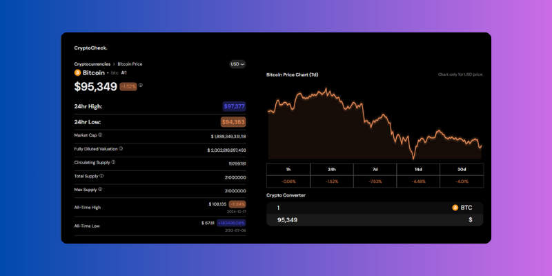
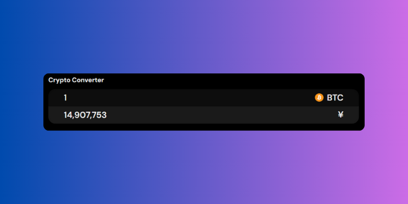

<h1 align="center">CryptoCheck</h1>

  
  
Stay updated on cryptocurrency prices and market trends with <a href="https://cryptocheck.vercel.app/" target="_blank" rel="noopener noreferrer">CryptoCheck</a>, your go-to web application for real-time crypto insights.

## Table of Contents
- [Introduction](#introduction)
- [Features](#features)
  - [Real-Time Data](#real-time-data)
  - [Detailed Coin Insights](#detailed-coin-insights)
  - [Currency Conversion](#currency-conversion)
- [Usage](#usage)
- [Project Screenshots](#project-screenshots)
- [License](#license)

## Introduction
CryptoCheck is a powerful cryptocurrency tracking tool that provides real-time price updates, detailed market insights, and the ability to convert between over 11 fiat currencies and popular cryptocurrencies. Whether you're analyzing trends or performing conversions, CryptoCheck is the ideal app for crypto enthusiasts.

## Features

### Real-Time Data:
- **Live Price Updates:** Stay updated with real-time prices for major cryptocurrencies.
- **Search Functionality:** Quickly find the coin you're looking for.

### Detailed Coin Insights:
- **Comprehensive Coin Information:** Click on "Click More" to view in-depth details about your chosen cryptocurrency.
- **Dynamic Data:** View live updates about the coin's market cap, trading volume, supply, and other key statistics.

### Currency Conversion:
- **Over 11 Currencies Supported:** Convert cryptocurrency values into fiat currencies like USD, EUR, GBP, and more.
- **Integrated Converter:** Seamlessly switch between coins and currencies for accurate, real-time conversions.

## Usage
1. Use the search bar to find your desired cryptocurrency.
2. Click the **"Click More"** button to view detailed information about the coin.
3. Choose from over 11 fiat currencies to convert the selected coin's value.
4. Analyze the live data and perform conversions with ease.

## Project Screenshots

  
  
  

## License
This project is licensed under the MIT License.
