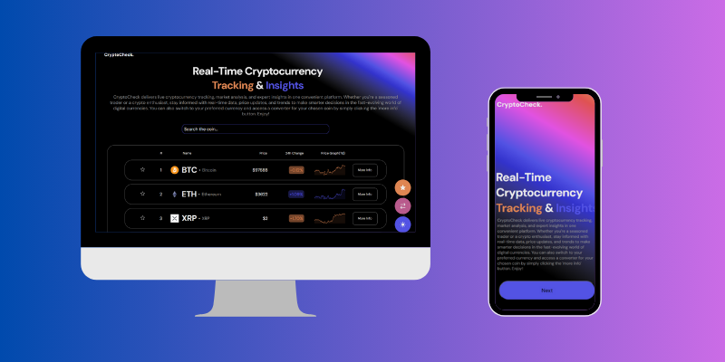
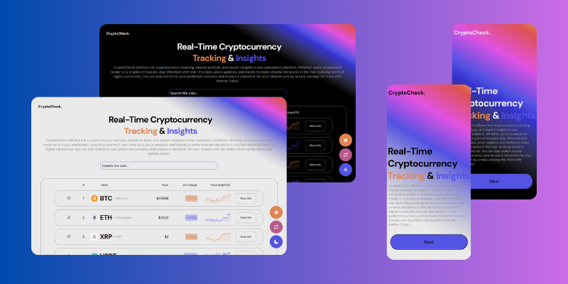
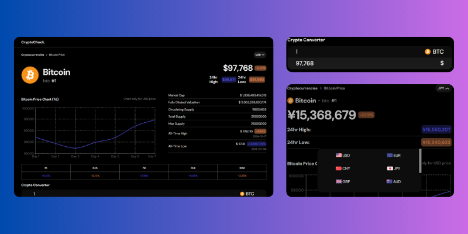
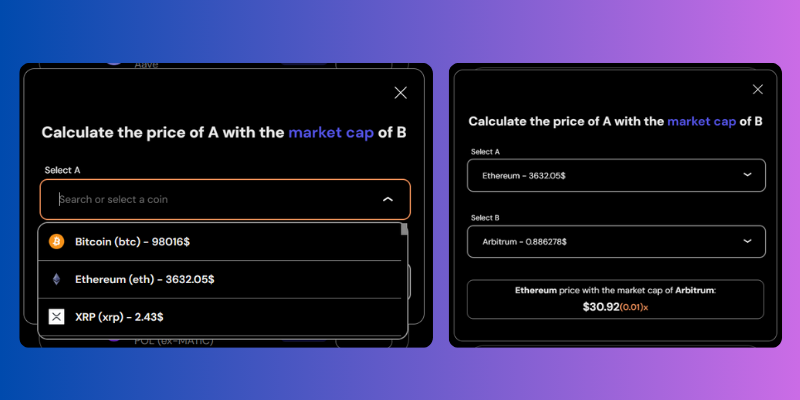

<h1 align="center">CryptoCheck</h1>

  
  
Stay informed about the cryptocurrency market with <a href="https://cryptocheck.vercel.app/#/" target="_blank" text-decoration="none">CryptoCheck</a>, your go-to platform for real-time coin tracking and insights.

## Table of Contents
- [Introduction](#introduction)
- [Features](#features)
  - [Real-Time Cryptocurrency Tracking](#real-time-cryptocurrency-tracking)
  - [Portfolio Management](#portfolio-management)
  - [Coin Comparison Tool](#coin-comparison-tool)
  - [Detailed Coin Information](#detailed-coin-information)
  - [Theming and Currency Options](#theming-and-currency-options)
  - [User-Friendly Interface](#user-friendly-interface)
- [Usage](#usage)
- [Project Screenshots](#project-screenshots)
- [Built with](#built-with)
- [License](#license)

## Introduction
CryptoCheck is a powerful web application designed for cryptocurrency enthusiasts, traders, and investors. With its intuitive design and robust functionality, CryptoCheck provides users with real-time information on popular cryptocurrencies, portfolio management, comparison tools, and detailed pages for individual coins. Whether you’re tracking the market or researching a specific coin, CryptoCheck has you covered.

## Features

### Real-Time Cryptocurrency Tracking:
- **Market Overview:** View the latest prices, market trends, and changes for major cryptocurrencies.
- **Live Updates:** Stay up-to-date with real-time data refreshes.
- **Search Functionality:** Quickly find the cryptocurrency you're interested in by name or symbol.

### Portfolio Management:
- **Favorite Coins:** Add your preferred cryptocurrencies to a personalized portfolio.
- **Local Storage:** Persistently save your portfolio data using local storage.

### Coin Comparison Tool:
- **Market Cap Calculator:** Compare two cryptocurrencies by calculating the price of one based on the market cap of the other.

### Detailed Coin Information:
- **Individual Coin Pages:** Explore dedicated pages for each cryptocurrency with additional details like market cap, volume, historical data, and more.
- **Interactive Charts:** Visualize price trends over various timeframes.
- **Currency Conversion:** Convert a cryptocurrency's value into 13 different fiat currencies or another cryptocurrency of your choice.

### Theming and Currency Options:
- **Light and Dark Modes:** Switch between light and dark themes for a comfortable viewing experience.
- **Currency Customization:** Select from 13 different currencies for personalized data representation.

### User-Friendly Interface:
- **Clean Design:** Intuitive layout for seamless navigation.
- **Responsive Design:** Optimized for desktop, tablet, and mobile devices.

## Usage
1. Navigate to the [CryptoCheck website](https://cryptocheck.vercel.app/#/).
2. Use the search bar to find a specific cryptocurrency or browse the list of trending coins.
3. Add coins to your portfolio to keep track of your favorites.
4. Use the comparison tool to analyze the market cap-based price of one coin against another.
5. View detailed coin information, convert between currencies, and explore historical data.
6. Toggle between light and dark mode for a personalized experience.

## Project Screenshots

  
  
  

## Built with:
- **React.js** - A JavaScript library for building user interfaces.
- **JavaScript (ES6+)** - For application functionality and interactivity.
- **HTML5** - For structuring the application.
- **CSS3** - For styling and layout.
- **API Integration** - Fetching real-time cryptocurrency data.
- **LocalStorage** - To persist user data like portfolios and settings.
- **Responsive Design Techniques** - Ensures compatibility across all devices.

## License
This project is licensed under the MIT License.
